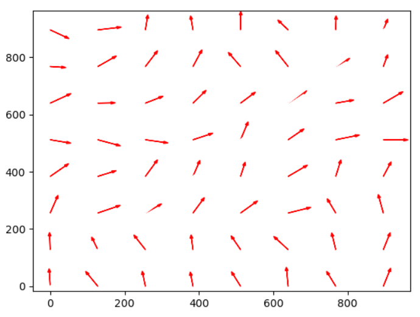
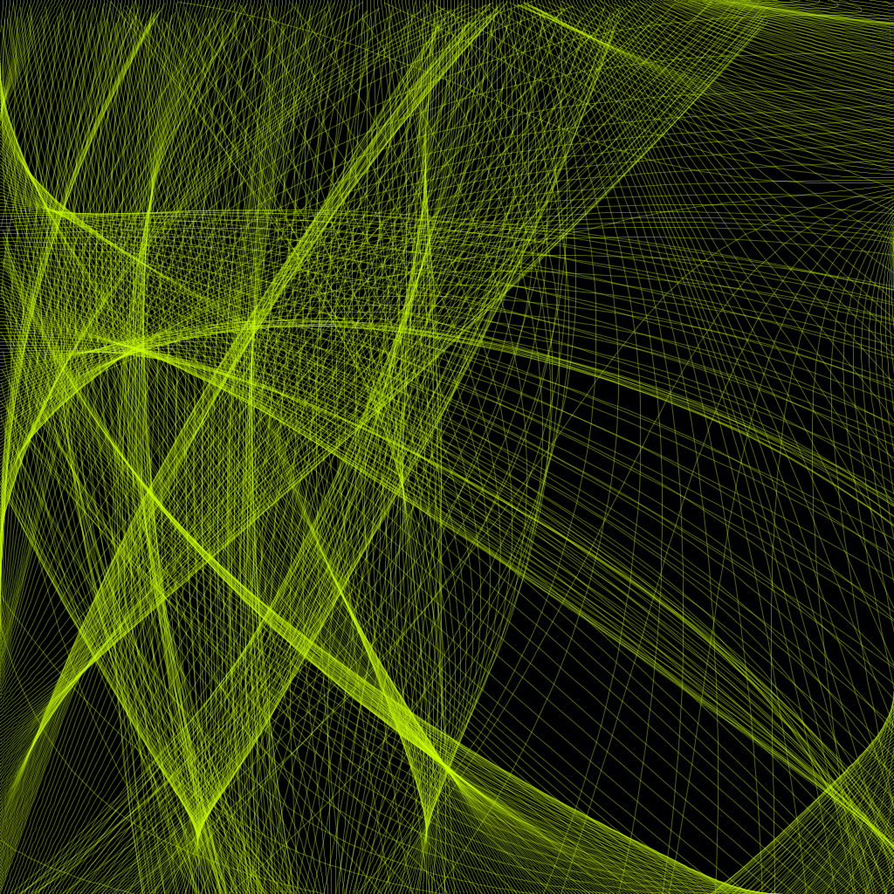
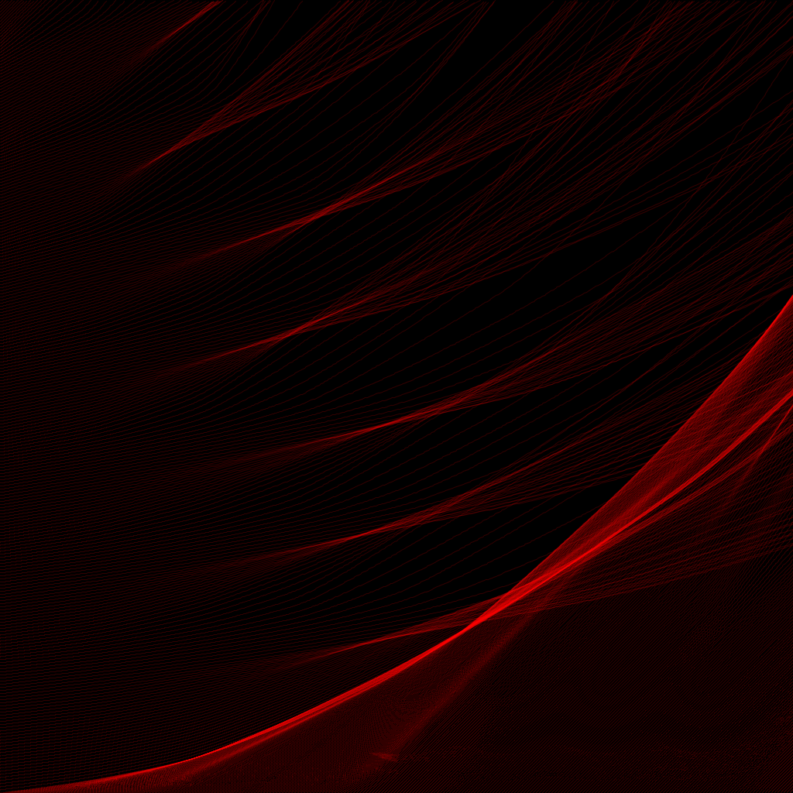
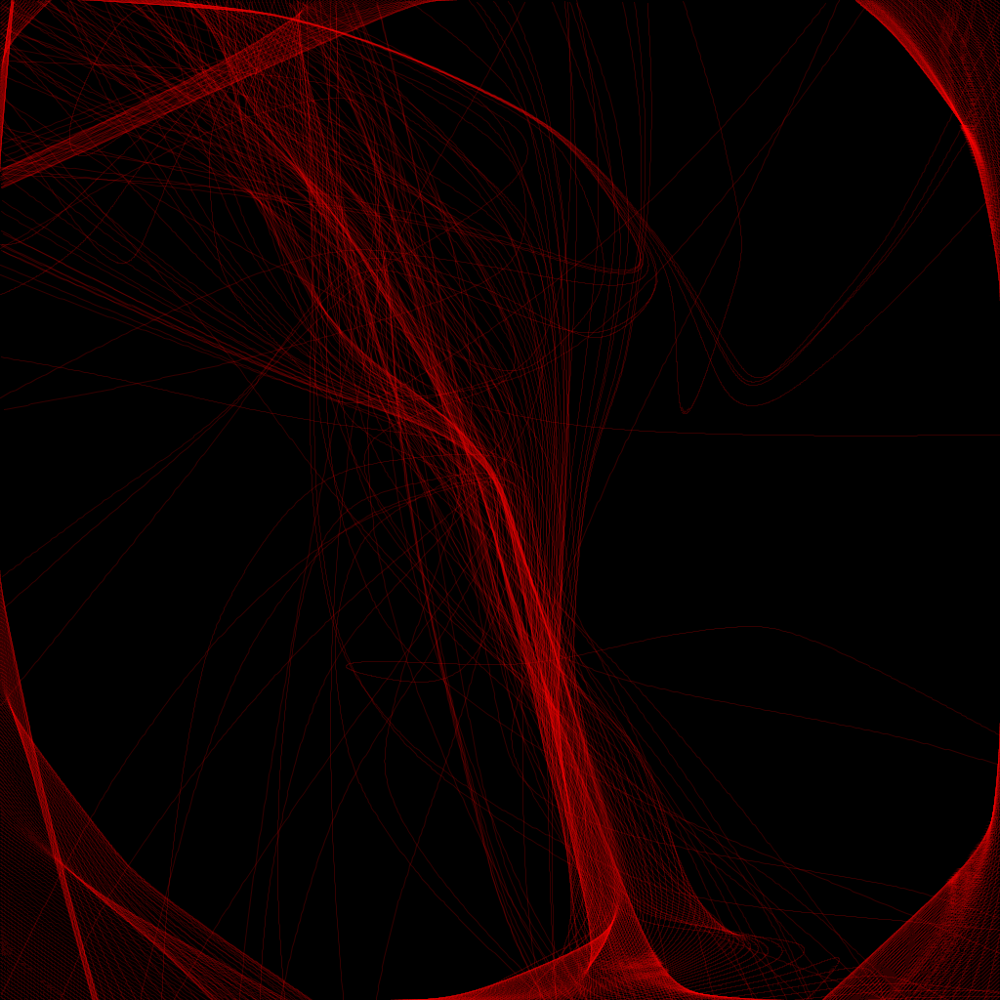
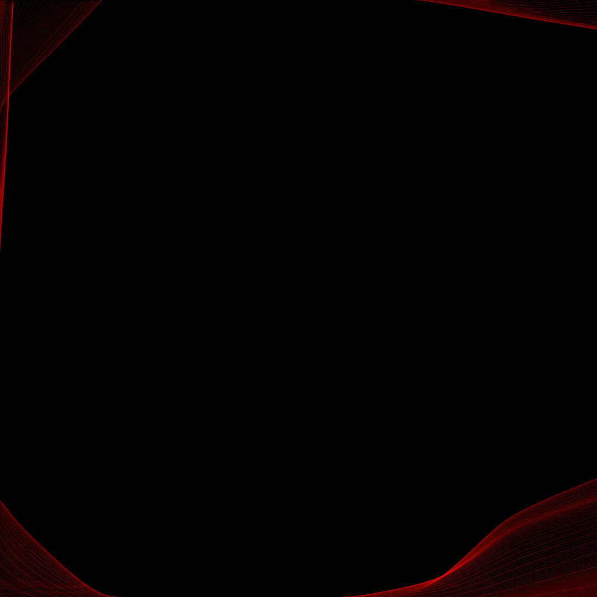

# Perlin Noise Generative Art

This is a program designed to generate art simulating projectiles reacting to a vector field. Some number of projectiles are placed at each edge of the canvas, at which point they are fired in order to produce the patterns of their movement.

Apologies to anyone who may attempt to fork this repository, nothing in this script was written with the intention of promoting readability, or even being good code (as you may have noticed from the four identical for loops in the main function, or the fact that my main function does not contain the main program). This is my first attempt at generative art, so my main priority was just producing something, as opposed to creating a program to be used repeatedly by others. Consider this repository as documentation of my method more than anything else.

Credit to Tim Holman for his [Generative Art Speedrun Lecture](https://youtu.be/4Se0_w0ISYk) which gave me the idea to fire projectiles through a kind of perlin noise. Admittedly I've used the ideas behind perlin noise fairly loosely here so it's arguable that this repository should be renamed, but it's still present in most of the images so I'm not going to change the title.

## Gallery

## Vector Field Generation

### Random

The random vector generation algorithm takes the numbers of vectors present in the field as the square of side length divided by the density. It assumes that `m.log2(sideLength/vectorDensity)` is a natural number, for reasons that will become apparent shortly. An initial vector is specified as a tuple of two components with magnitude varying between -16 and 16 using the uniform function. From this point onwards all vectors are calculated using magnitude and angle in order to gain greater control over the variation.

A chain of random number generators is used to create each vector, recalling only the angle and magnitude of the previous vector in order to create the subsequent one. This requires that the vector field is represented as a one-dimensional array however, and thus a pseudo hilbert curve is used to translate this chain (manually terminated upon having completed the field) into a two-dimensional array. This function is used due to ensuring that the distance between two one-dimensional inputs (`x1 - x2`) is roughly proportionate to the distance between the two corresponding two-dimensional inputs (`m.sqrt(x1**2+y1**2) - m.sqrt(x2**2+y2**2)`).

For each step some change in angle and magnitude is produced in some range in order to limit the extent to which the vector field may produce conflicting vectors in close proximity (this could potentially result in both significantly increased render times due to low projectile acceleration, as well as creating an excessively random effect). In oder to prevent excessive growth in magnitude a redistribution function is applied to the magnitude of `2*m.exp(-(x/8)**2)`, multiplied by the generated magnitude in order to normalise all values outside of the function's standard deviation. is then converted into vector form to be placed within the two-dimensional grid array. Below is an example of a vector field generated by this process, and the corresponding image.

In some cases the vector field may be saved using [lastField.txt](./lastField.txt), which saves the last vector field produced, and thus this may be copied into [savedFields.txt](./savedFields.txt) (this is currently done manually whenever I like the look of a specific vector field).

### Manual

Alongside the random generation algorithm I have also programmed two other algorithms to force specific curvature patterns. These include the clockwise rotation and the full circle function (although this has been repurposed to create a magnetic field effect by relating the magnitude only to the x-axis). Examples of these are shown below:

## Projectile Simulation

### Physics

All projectiles are initalised with zero acceleration at some point on the edge of the vector field with zero acceleration. Upon initialising their rollout they continuously update until their position exceeds the bounds of the image resolution. Veering away from real world physics, the influence of each vector is calculated as an exponential decay relative to the distance between the projectile and the respective vector (`m.exp(-kx)` where `x` is the distance, and `k` is a constant by which the decay is regulated). At each update this is calculated for every vector present in order to provide the current total force accting on the projectile. There is an implied resistance to direction of motion acting on the projectile at all points caused by a set decay of 0.05% per update for the purpose of varying the effects created.

If the force acting on projectiles is too low this results in an excessive number of updates per projectile, which may cause excessively long runtimes. This may be fixed through changes such as decreasing the rate of proximity decay, for this may solve issues caused by local conflicts (hilbert curves may cause jumps around the lower centre resulting in this opposition). Alternatively this may be remedied through varying the vector density, however in my view it is more ideal to relate physics purely to the projectile itself, and thus the proximity decay is decreased relative to the vector density.

### Drawing

Each projectile updates its history with each update, creating a list of points which may be used to draw a curve. Initially drawing was done through repeatedly plotting lines at each update, however this resulted in jagged plots, and thus the program now uses splines instead to generate curves from the points given.

In order to create 3D effects the alpha value of the stroke colour is set to 100 out of 255, allowing depth to seem varied due to layered lines creating more solid forms.

For the sake of simplicity I use the HSB system for colour specification, as I don't feel any colours with a saturation or lightness below 100% would be appropriate.

## Rendering

This program uses [Processing.py](https://py.processing.org/) in order to render all images. This is a language using Python 2.7 syntax combined with image rendering capabilities to be ran within the Processing environment. This script was prototyped in pure python using matplotlib.pyplot, and subsequently transferred into the Processing environment after initial testing was complete.
